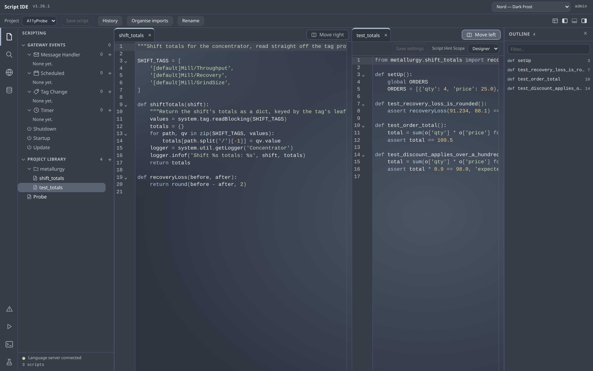
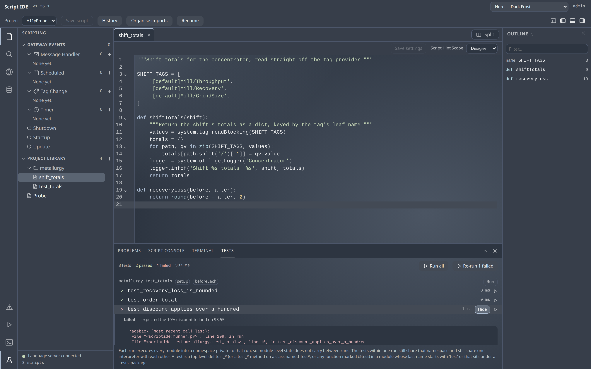

# Script IDE for Ignition

Write Ignition scripts in a real editor, in the browser, against the live gateway.

**Version**: 1.24.0 · **Module ID**: `com.gaskony.scriptide` · Ignition 8.3+

---

## Why this exists

Ignition's Designer ships a script editor that has been essentially unchanged for
years: syntax highlighting and a completion popup in a Swing text area. Anyone who
writes Python anywhere else is used to go-to-definition, symbol search, errors
before you save, and a console that runs what you just wrote.

Inductive Automation's own stated direction is to expose the Language Server
Protocol so you can use your own IDE — they rejected embedding a browser engine in
the Designer, because Chromium is only present when Perspective is installed. As of
April 2026 nothing had been committed.

So the gap is real and stable, and it is worth filling from the other side: not
"bring your project to your IDE", but **bring a real IDE to the gateway** — no
install, no Designer, reading the API of the gateway that is actually running.

## What it looks like


*Editing a project library script. The left rail groups scripts by type and marks
inherited resources; the footer shows whether the language server is connected.*


*Completions come from **the gateway you are connected to** — real parameter names,
defaults and documentation, including functions from whichever modules that gateway
actually has installed. No static stub file can know that.*


*Errors are checked by the gateway's own Jython 2.7 parser, so Python-2 code —
`print "x"`, `except E, e:`, `10L` — is never wrongly flagged.*


*Two scripts at once, in one window. Either pane can hold any open document, the
divider is draggable, and Ctrl+\\ splits and collapses it.*


*Jython tests, discovered and run on the gateway. A failure and an error are kept
apart: an error never got far enough to have an opinion.*


*It appears on the Gateway home page like any other module.*

## What it does

- **Edit** Project Library scripts and Gateway event scripts (timer, message,
  startup, shutdown, scheduled, tag change), written through the platform's own
  resource API — so no file stamping and no project scan. Saved scripts are
  importable a couple of seconds later.
- **Run** a buffer, a selection, or the file in the active tab on the gateway.
  Output appears as it is produced — flushed on a newline, at 4 KB or every
  100 ms — so a loop shows its first line before its last. A failure comes back
  as a real traceback, `File "…", line N, in f`, and a frame inside a project
  library script opens that script at the line. Stop is read while the script is
  still running, and Reset drops the console's variables the way the Designer's
  does. Concurrent users never see each other's output. The editor and the output
  sit either above one another or side by side, whichever you choose, with a
  divider you can drag — and it opens in its own browser tab if you want the
  whole window.
- **Autocomplete and signature help** from the running gateway's script registry.
- **Live error checking** against the real Jython 2.7 parser — plus a name that
  is defined nowhere, a deprecated platform call, and `system.gui` in a script
  that runs on the Gateway. CSS, JavaScript, JSON, SQL and HTML documents are
  checked by their own parsers, so every file the IDE opens has error signalling
  rather than only the Python ones.
- **Outline** the open script — every class and function, click to jump — parsed
  by the gateway rather than by a client-side grammar, so Python 2 code outlines
  correctly. Find and replace are in the editor on Ctrl+F.
- **Navigate the project.** Go to definition on F12 or Ctrl-click, across files.
  Quick open on Ctrl+P, with `#` to jump to a function or class anywhere in the
  project. A Search view that reads every script on the gateway — Project
  Library, Gateway Events, Web Dev handlers and pages, and named-query SQL — not
  just the open ones, and can **replace** across all of it with a preview and a
  per-file report. Shift+F12 lists every place a name is written — matched by
  name rather than by type, which the results say plainly. A Problems panel
  collecting the errors in every open script, alongside what the gateway has
  actually logged while running them. Folding, and go-to-line on Ctrl+G.
- **Web Dev** endpoints as a first-class view: all eight HTTP methods, per-method
  settings, create and delete.
- **A terminal on the gateway** — a real shell on a real pseudo-terminal, with a
  prompt, history, Ctrl-C and colour. It is what makes `git` usable against the
  projects directory. Same gate as execution, with its own switch. What it runs
  as is decided by the host, never by this module: a root shell through the
  Docker daemon where the socket is mounted and writable, otherwise root through
  `sudo -n` where the host already grants it, otherwise the Gateway's own
  operating-system user. Closing the tab ends the shell and the jobs it
  started.
- **A way back.** Every save is kept per user, including the version that was
  there before your first one, and restoring loads the buffer rather than
  writing it. The console keeps what you have run — source and output — across
  gateway restarts. An override can be compared against the project it inherits
  from before you discard it.
- **Guards on the way out.** A save that does not parse asks once first. A save
  that removes or re-declares a function names its call sites before the write.
  Neither refuses — both make it deliberate.
- **Export and import code**, in the Designer's own resource-zip format — so a
  file written here opens there and the other way round, which was proved by
  doing it rather than assumed. Right-click a script or a package to export;
  import lists what an archive holds and says which scripts it would replace
  before you commit to it.
- **Two scripts side by side.** Split the editor and read one script while
  editing another — the thing the Designer cannot do at all. Either pane takes
  any open document, the divider is draggable and its width is remembered.
- **Run your Jython tests.** A `def test_*` in a module named for tests is
  discovered, run on the gateway in an isolated interpreter, and reported as
  passed, failed, errored or skipped — with how long it took, the traceback, and
  whatever it printed before it stopped. `setUp` and `tearDown` work the way
  `unittest` means them.
- **Write them with a real framework.** `@test`, `@skip`, `@cases` for
  parameterised runs, `@beforeEach` and the rest, twelve assertions, and
  `mockTags` / `mockQuery` to answer tag reads and queries from a dict and record
  what the code under test wrote. Each module is executed into a namespace
  private to the run, so module state does not carry from one run to the next.
  See [docs/TEST-FRAMEWORK.md](docs/TEST-FRAMEWORK.md).
- **Snippets with tab-stops.** Eighteen starting points for the things you write
  over and over — a logger, a prepared query, a transaction, a Web Dev handler, a
  tag-change body — in the completion popup; tab through the placeholders.
- **Completion that knows your gateway.** Type `"[` in a string and it offers the
  real tag providers, then browses each level as you type `/`. In a string that
  looks like SQL it offers tables and columns from every configured datasource,
  each labelled with the connection it came from.
- **Organise imports**, and suggested imports for a name the file does not
  define — from your own project's modules first. It loads the result into the
  editor as an ordinary edit, so Ctrl+Z undoes it and nothing is written until
  you save.
- **Seven style checks** beside the real parser's errors: a bare `except:`, a
  mutable default argument, `== None`, `is` against a literal, an assert on a
  tuple, a duplicate dict key, and a file that mixes tabs and spaces. They are
  read off the syntax tree, so none of them fires on the same words inside a
  string or a comment.
- **Colour in the console.** `cprint` and `jsonPrint` are there in every run, and
  output that carries ANSI is rendered rather than shown as escape bytes.
- **Start from a template.** Six starting points for a new library script — a
  documented module, a parameterised database read, a transaction, tag
  read/write, a test module, a module with a logger. Each one is compiled
  against the gateway's own Jython before it ships.

- **Nothing is lost if the tab dies.** Unsaved buffers are kept in your browser
  as you type and offered back next time the page loads. Restoring opens the
  gateway's current copy and puts your text over it, so you can see what you are
  about to save.

- **Take the console output with you.** Export writes it to a text file with
  times and without colour codes, and Times stamps each block on screen.

- **See who else has the file open.** A bar above the editor and a badge on the
  tab when somebody else is in the same script — from another browser, or from
  the Ignition Designer, read from the platform's own concurrent-editing feed.
  It names them and says where they are working from, and it never blocks a
  save: the point is to find out before the clash, not to be stopped after it.

- **A VS Code-shaped shell**: activity bar, resizable side bar and outline, a
  bottom panel holding the console, the problems list and the terminal, and the
  four layout glyphs in the title bar.

Breakpoint debugging is deliberately **not** included: the only serious Ignition
debugger requires a running Designer, which defeats the point of a browser IDE.

## Byte fidelity

A script saved here is byte-identical to one saved by the Designer — tabs stay
tabs, and no trailing newline is added. That is asserted on every release against
the gateway's own filesystem, not just in a round trip, because a diff-noisy save
makes every subsequent `git diff` useless.

## Requirements

- Ignition **8.3.0+**
- A Gateway account with the **Administrator** role to edit or run scripts.
  Any authenticated user gets the full language intelligence without the Run
  button.

## Security

An Administrator using this module can do anything the Gateway JVM can do. That is
the Designer's existing threat model, not a new one — Designer access already runs
arbitrary Jython on the gateway. There is no sandbox, and a fake one would be worse
than none.

Execution requires an authenticated session, the Administrator role, a CSRF token,
and a same-origin WebSocket handshake. Every run is audited by hash, and execution
can be switched off gateway-wide with
`-Dcom.gaskony.scriptide.execution.enabled=false`.

The terminal is gated the same way and has its **own** switch
(`-Dcom.gaskony.scriptide.terminal.enabled=false`), so a site can keep the Script
Console and refuse the shell. It grants no privilege that Jython's
`Runtime.exec` did not already reach — see `SECURITY.md`, which says so plainly
rather than resting on the equivalence.

Both sets of switches are also read live from
`<gateway data dir>/modules/scriptide/policy.properties` — same keys as the `-D`
names, standard `java.util.Properties`, re-read within two seconds — so a site
can turn execution or the terminal off on a **running** gateway. The module never
creates that file; absent means no overrides. A system property still states the
fleet default at boot, and the file wins over it. Because the file can also turn
the Administrator requirement off, its permissions belong to the Gateway's own
user and nobody else, exactly like `ignition.conf`.

## Build

```bash
./gradlew clean build     # runs the frontend test suite too
```

Requires JDK 17 and Node.js. Signing is skipped automatically when no keystore is
configured; see `gradle.properties.template`.

## Licence

Internal. Not published to the module portal.
