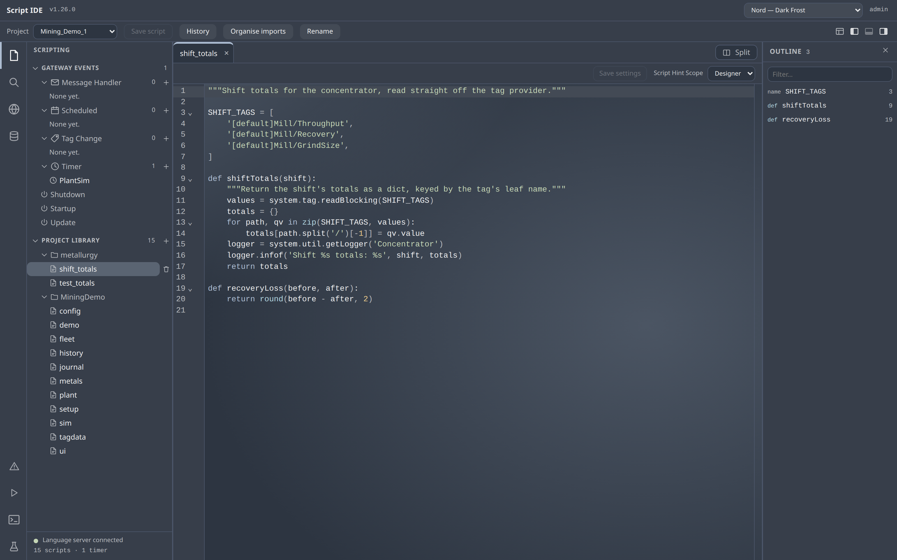
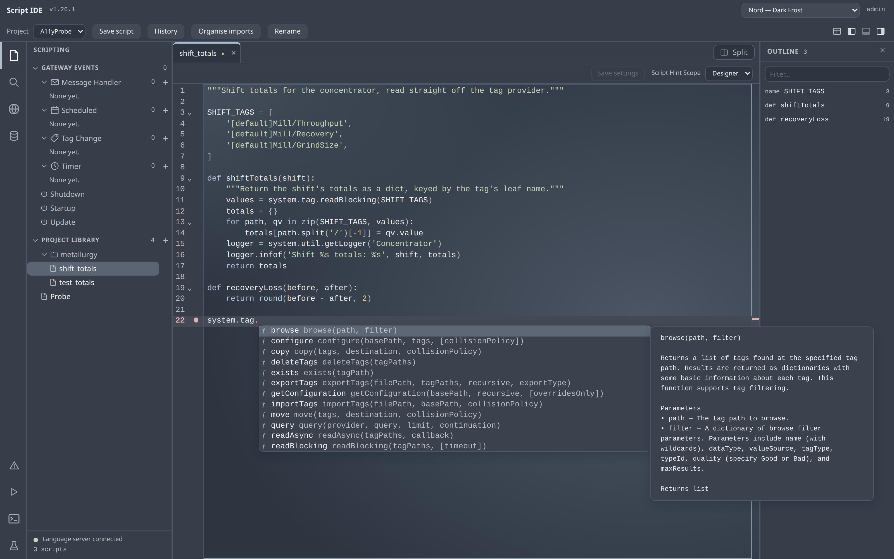
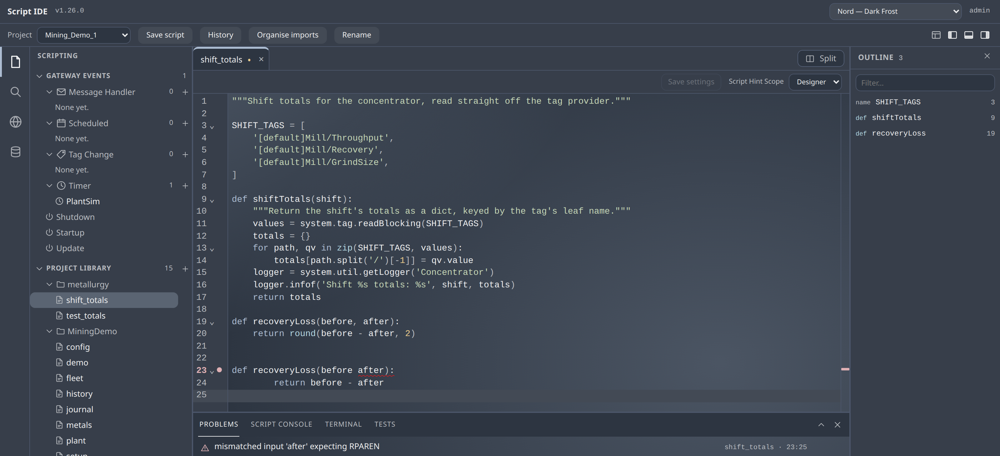
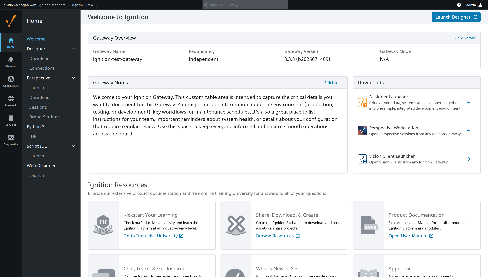

# Script IDE for Ignition

Write Ignition scripts in a real editor, in the browser, against the live gateway.

**Version**: 1.4.2 · **Module ID**: `com.gaskony.scriptide` · Ignition 8.3+

---

## Why this exists

Ignition's Designer ships a script editor that has been essentially unchanged for
years: syntax highlighting and a completion popup in a Swing text area. Anyone who
writes Python anywhere else is used to go-to-definition, symbol search, errors
before you save, and a console that runs what you just wrote.

Inductive Automation's own stated direction is to expose the Language Server
Protocol so you can use your own IDE — they rejected embedding a browser engine in
the Designer, because Chromium is only present when Perspective is installed. As of
April 2026 nothing had been committed.

So the gap is real and stable, and it is worth filling from the other side: not
"bring your project to your IDE", but **bring a real IDE to the gateway** — no
install, no Designer, reading the API of the gateway that is actually running.

## What it looks like


*Editing a project library script. The left rail groups scripts by type and marks
inherited resources; the footer shows whether the language server is connected.*


*Completions come from **the gateway you are connected to** — real parameter names,
defaults and documentation, including functions from whichever modules that gateway
actually has installed. No static stub file can know that.*


*Errors are checked by the gateway's own Jython 2.7 parser, so Python-2 code —
`print "x"`, `except E, e:`, `10L` — is never wrongly flagged.*


*It appears on the Gateway home page like any other module.*

## What it does

- **Edit** Project Library scripts and Gateway event scripts (timer, message,
  startup, shutdown, scheduled, tag change), written through the platform's own
  resource API — so no file stamping and no project scan. Saved scripts are
  importable a couple of seconds later.
- **Run** a buffer or a selection on the gateway, with output streamed back and a
  clickable traceback. Concurrent users never see each other's output.
- **Autocomplete and signature help** from the running gateway's script registry.
- **Live error checking** against the real Jython 2.7 parser.
- **Navigate** — go to definition, document outline, project-wide symbol search and
  cross-file text search over your own scripts.
- **Web Dev** endpoints as a first-class view: all eight HTTP methods, per-method
  settings, create and delete.
- **A terminal on the gateway** — a real shell on a real pseudo-terminal, with a
  prompt, history, Ctrl-C and colour, running as the Gateway's own user. It is
  what makes `git` usable against the projects directory. Same gate as execution,
  with its own switch.
- **A VS Code-shaped shell**: activity bar, resizable side bar and outline, a
  bottom panel holding the console and the terminal, and the four layout glyphs
  in the title bar.

Breakpoint debugging is deliberately **not** included: the only serious Ignition
debugger requires a running Designer, which defeats the point of a browser IDE.

## Byte fidelity

A script saved here is byte-identical to one saved by the Designer — tabs stay
tabs, and no trailing newline is added. That is asserted on every release against
the gateway's own filesystem, not just in a round trip, because a diff-noisy save
makes every subsequent `git diff` useless.

## Requirements

- Ignition **8.3.0+**
- A Gateway account with the **Administrator** role to edit or run scripts.
  Any authenticated user gets the full language intelligence without the Run
  button.

## Security

An Administrator using this module can do anything the Gateway JVM can do. That is
the Designer's existing threat model, not a new one — Designer access already runs
arbitrary Jython on the gateway. There is no sandbox, and a fake one would be worse
than none.

Execution requires an authenticated session, the Administrator role, a CSRF token,
and a same-origin WebSocket handshake. Every run is audited by hash, and execution
can be switched off gateway-wide with
`-Dcom.gaskony.scriptide.execution.enabled=false`.

The terminal is gated the same way and has its **own** switch
(`-Dcom.gaskony.scriptide.terminal.enabled=false`), so a site can keep the Script
Console and refuse the shell. It grants no privilege that Jython's
`Runtime.exec` did not already reach — see `SECURITY.md`, which says so plainly
rather than resting on the equivalence.

## Build

```bash
./gradlew clean build     # runs the frontend test suite too
```

Requires JDK 17 and Node.js. Signing is skipped automatically when no keystore is
configured; see `gradle.properties.template`.

## Licence

Internal. Not published to the module portal.
